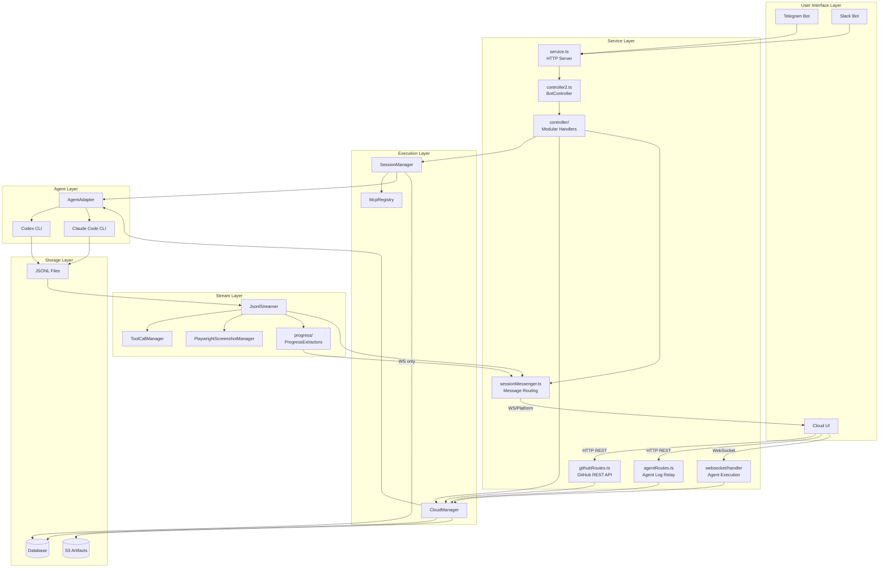
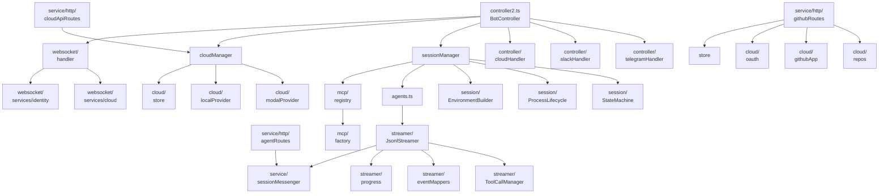
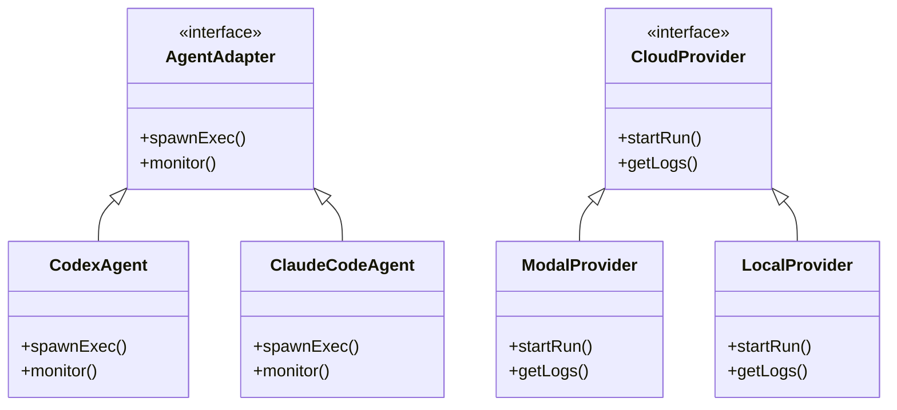
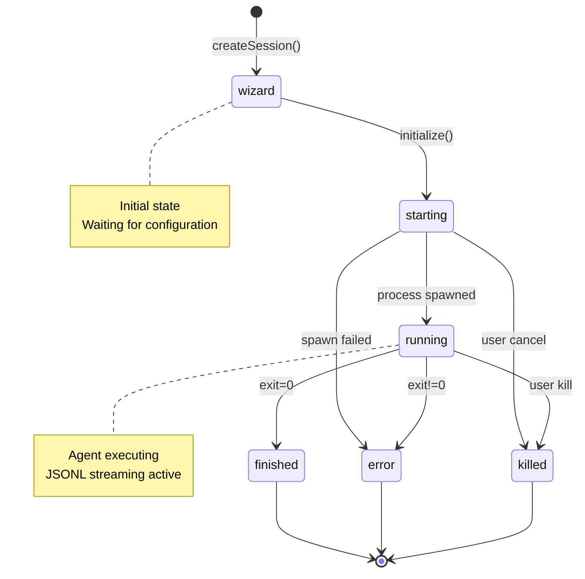
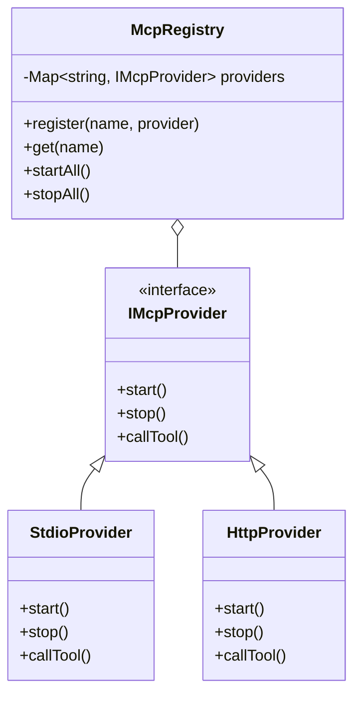
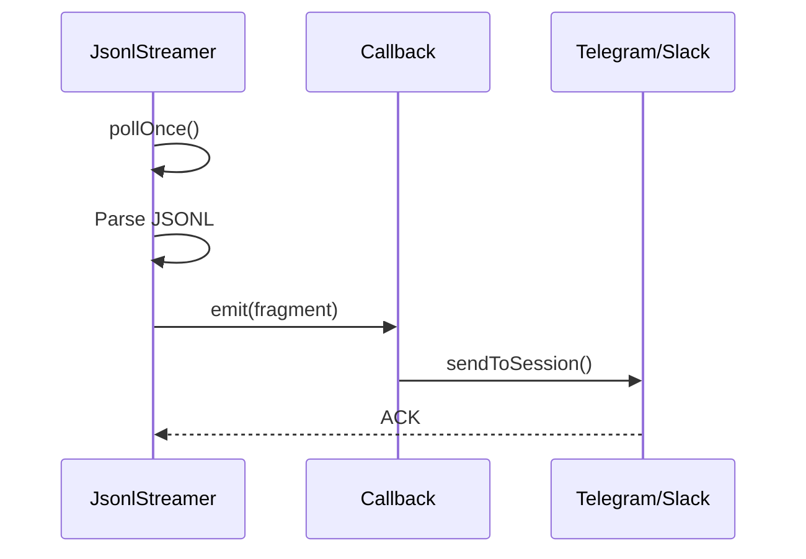

# Tintin - Architecture Documentation

Detailed system architecture, design patterns, and module relationships.

## System Layer Architecture



## Module Dependency Graph



## Architectural Patterns

### Strategy Pattern



### State Machine Pattern

Session state transitions:



### Builder Pattern

```typescript
// EnvironmentBuilder fluent interface
EnvironmentBuilder.create()
    .withLanguage('zh')
    .withCloudProxy(config.cloud.proxyUrl)
    .withChatGptProxy(config.chatgpt.enabled)
    .withMcpServers(mcpRegistry.getServers())
    .build();
```

### Registry Pattern



### Dependency Injection

All services receive dependencies via constructor:

```typescript
class SessionManager {
    constructor(
        private db: Database,
        private config: Config,
        private logger: Logger,
        private mcpRegistry: McpRegistry,
    ) {}
}
```

Benefits:
- Testable with mock implementations
- Clear dependency graph
- Easy to swap implementations

### Observer Pattern



## Component Responsibilities

| Module | Responsibility | Key Methods |
|--------|----------------|-------------|
| **service.ts** | HTTP server & bot initialization | start(), handleOAuth() |
| **service/httpServer.ts** | HTTP server setup & route mounting | createServer(), mountRoutes() |
| **service/sessionMessenger.ts** | Platform message formatting & WebSocket routing | sendToSession(), formatFragment() |
| **service/http/githubRoutes.ts** | GitHub HTTP REST API (auth, repos, OAuth, disconnect) | handleGithubApiRoutes() |
| **service/http/agentRoutes.ts** | Agent log relay, execution API & progress timeline | handleAgentLogRelay(), progress-timeline |
| **service/http/cloudApiRoutes.ts** | Cloud API endpoints | handleCloudApiRoutes() |
| **controller2.ts** | Central BotController | handleChat(), handleInteraction() |
| **controller/telegramHandler.ts** | Telegram-specific handling | handleCommand(), handleCallback() |
| **controller/slackHandler.ts** | Slack-specific handling | handleCommand(), handleShortcut() |
| **controller/cloudHandler.ts** | Cloud command handling | cloudHelp(), cloudStatus() |
| **controller/interactionHandler.ts** | Button/selection handling | handleInteraction() |
| **sessionManager.ts** | Agent session lifecycle | startNew(), resumeSession(), kill() |
| **session/SessionStateMachine.ts** | State transition validation | canTransition(), transition() |
| **session/ProcessLifecycleManager.ts** | Process registration/kill | register(), killAll() |
| **session/EnvironmentBuilder.ts** | Fluent env var builder | withLanguage(), withCloudProxy() |
| **session/ChatGptProxyManager.ts** | ChatGPT OAuth proxy lifecycle | startProxy(), stopProxy() |
| **cloud/manager.ts** | Cloud run orchestration | startRun(), getLogs(), snapshot() |
| **cloud/modalProvider.ts** | Modal sandbox provider | createSandbox(), execute() |
| **cloud/localProvider.ts** | Local provider (testing) | createSandbox(), execute() |
| **cloud/repos.ts** | Centralized repo sync logic | syncReposForIdentity(), fetchGithubRepos() |
| **cloud/notion/** | Notion MCP OAuth integration | discovery, oauth, registration, token |
| **websocket/handler.ts** | WebSocket agent execution messaging | handleMessage(), authenticate() |
| **websocket/services/cloud.ts** | CloudRunService | handleCloudRun(), subscribeRun() |
| **websocket/services/sandboxLifecycle.ts** | Sandbox provisioning | provisionSandbox() |
| **streamer/JsonlStreamer.ts** | JSONL to StreamFragment + progress emission | pollOnce(), emitProgressEvents() |
| **streamer/ToolCallManager.ts** | Tool call/output pairing | push(), shift(), clear() |
| **streamer/PlanUpdateHandler.ts** | Plan update parsing | handlePlanUpdate() |
| **streamer/eventMappers/** | Agent-specific event mapping | claudeMapper, codexMapper, helpers |
| **streamer/progress/** | Progress event extraction (WS-only) | extractProgress(), claudeExtractor, codexExtractor |
| **mcp/registry.ts** | MCP server lifecycle | register(), startAll(), stopAll() |
| **platform/telegram.ts** | Telegram client | sendMessage(), sendPhoto() |
| **platform/slack.ts** | Slack client | postMessage(), update() |
