# Tintin - Data Flow Documentation

Detailed data flow diagrams for key system processes.

## Local Agent Run Flow

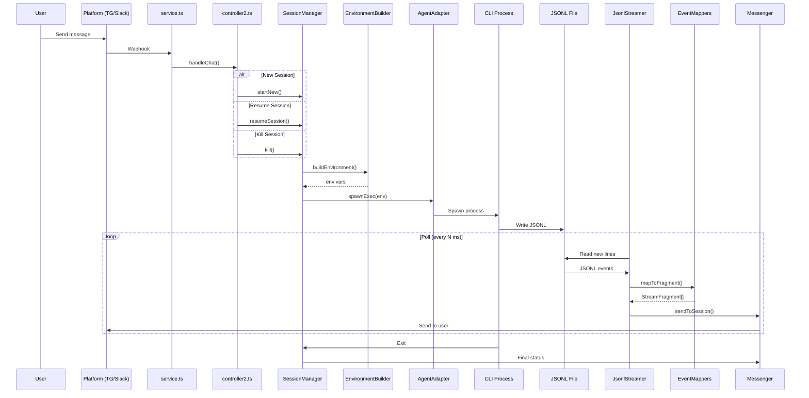

## Tool Call Pairing Flow

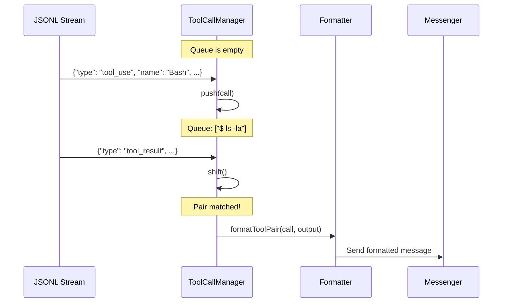

## Session State Machine

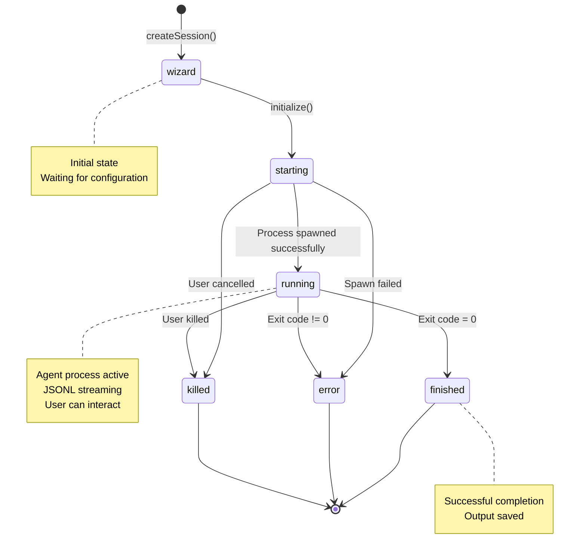

## GitHub HTTP REST Flow

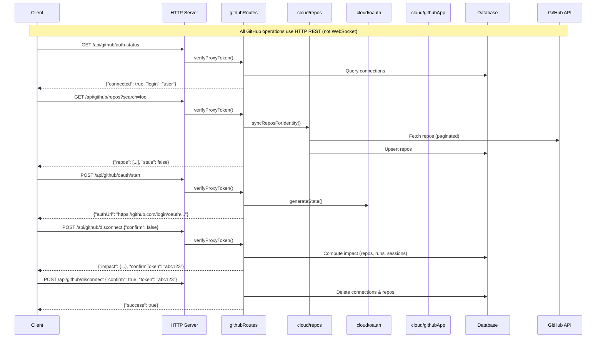

## WebSocket Agent Execution Flow

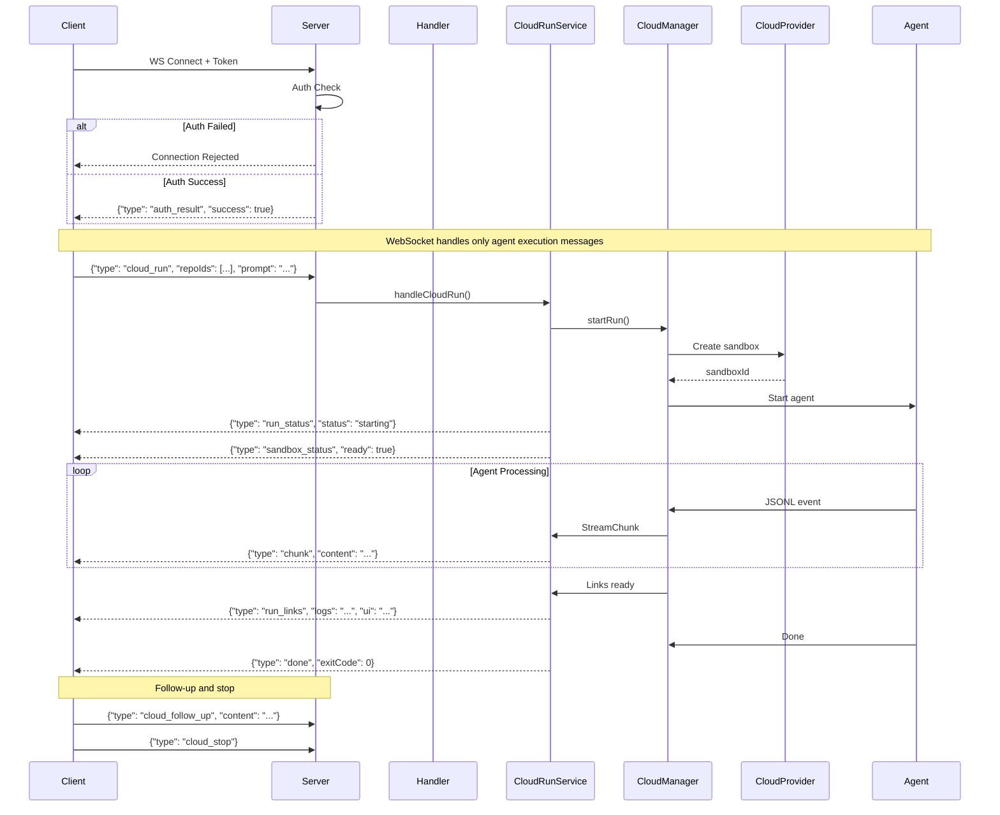

## MCP Server Lifecycle

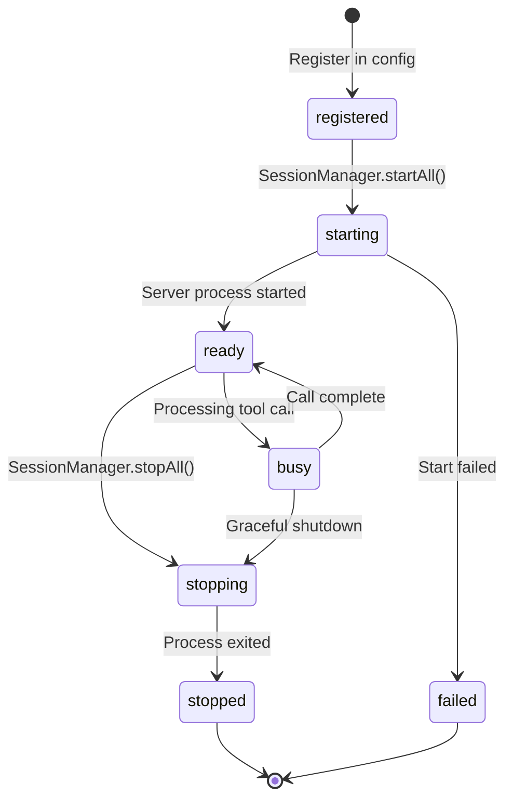

## Cloud Execution Flow

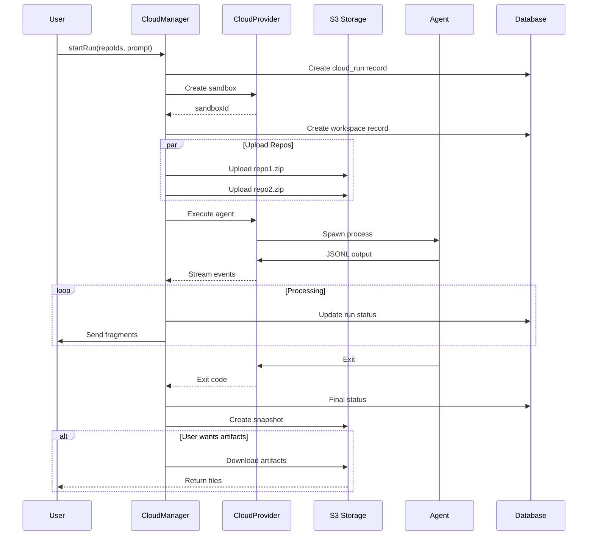

## GitHub App Integration Flow

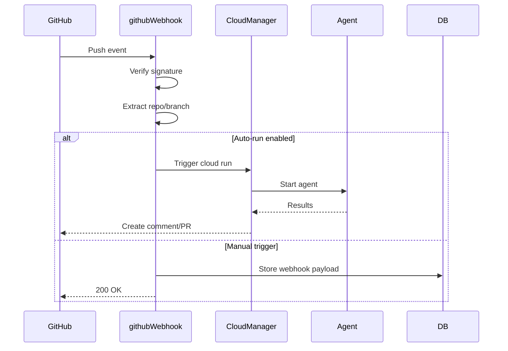

## OAuth Flow (GitHub/Slack/Notion)

### Platform OAuth (Telegram/Slack)

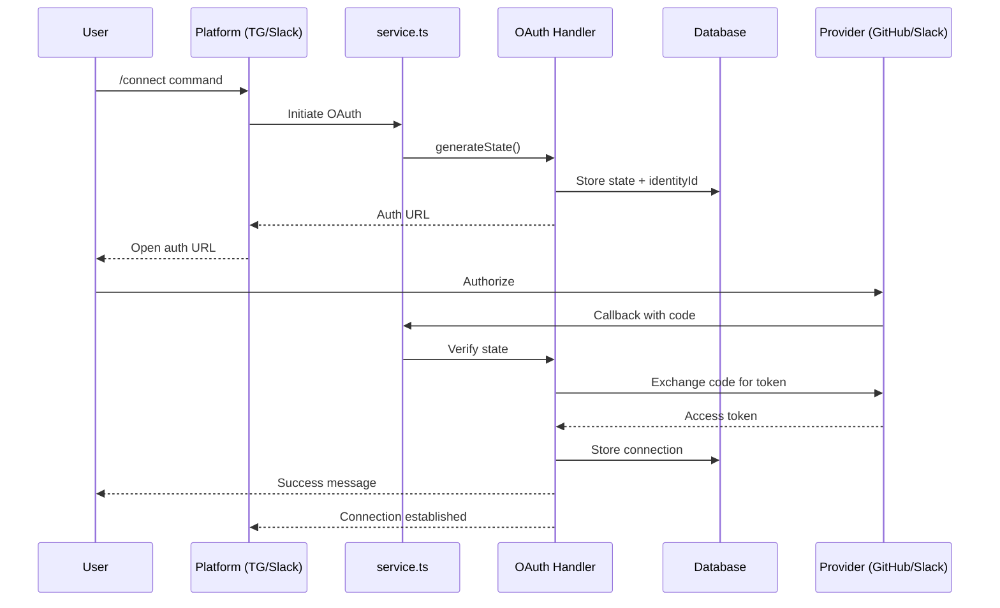

### HTTP OAuth (WebSocket/Cloud UI)

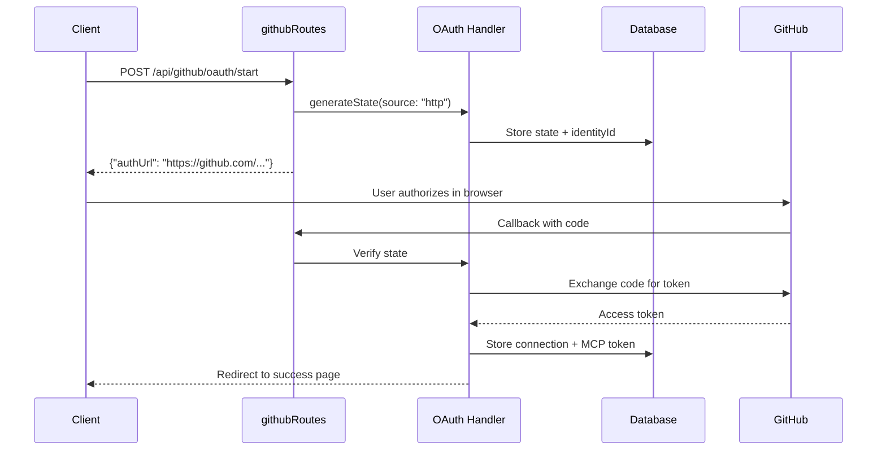

### GitHub App → OAuth Chaining

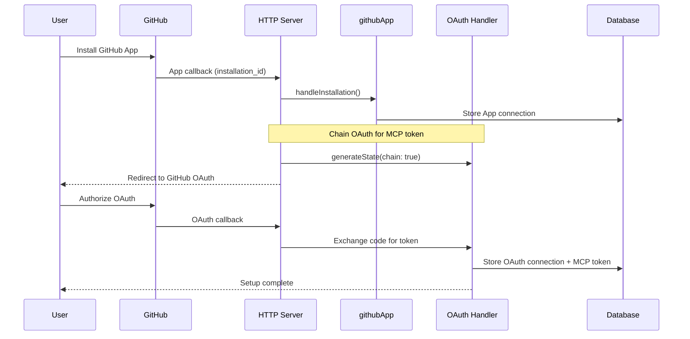

## WebSocket Tool Call/Output Streaming Flow

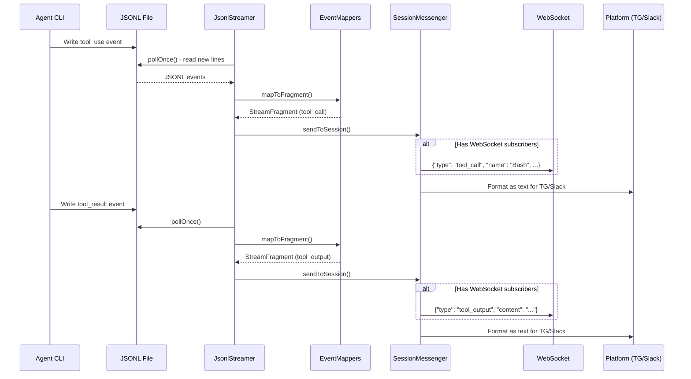

## Progress Event Extraction Flow

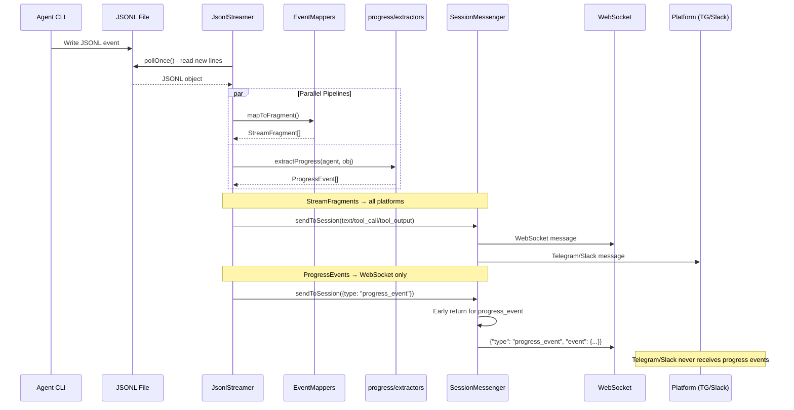

## Progress Timeline Replay (HTTP)

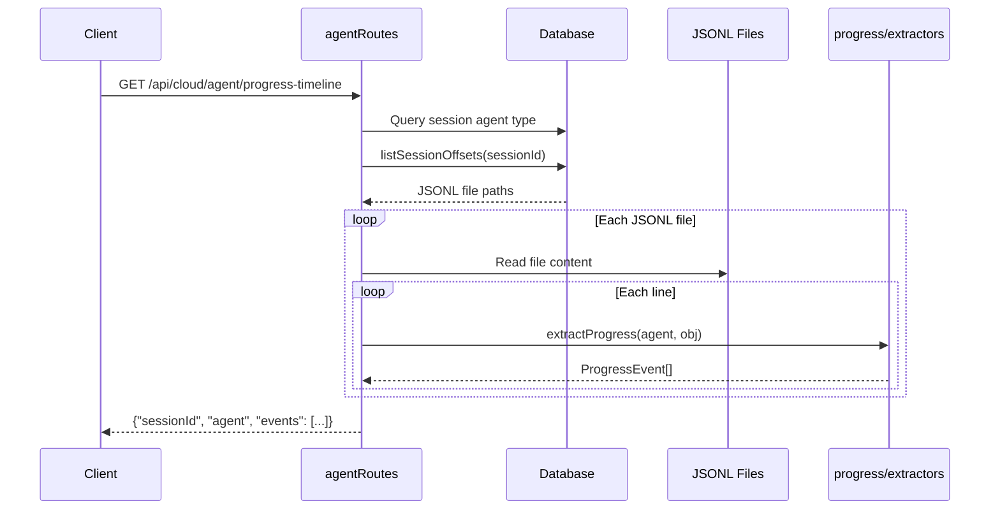

## Message Verbosity Levels

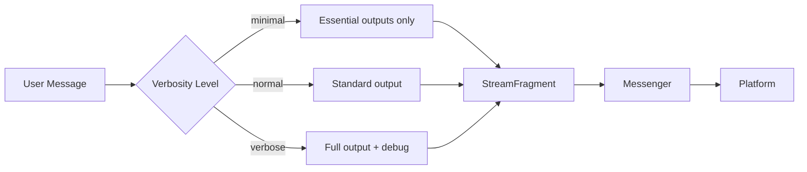

## Language Flow

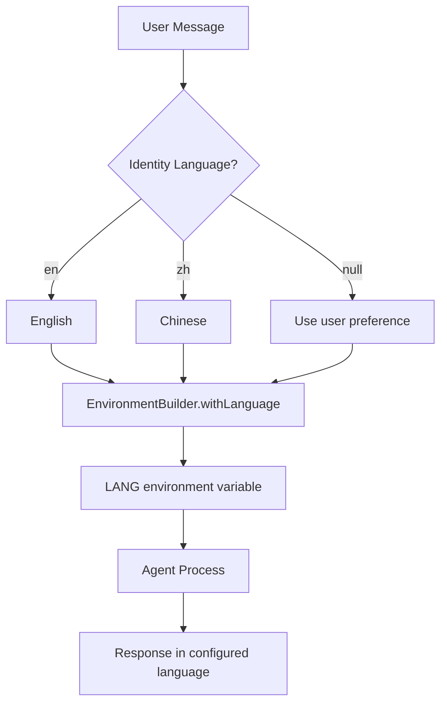
