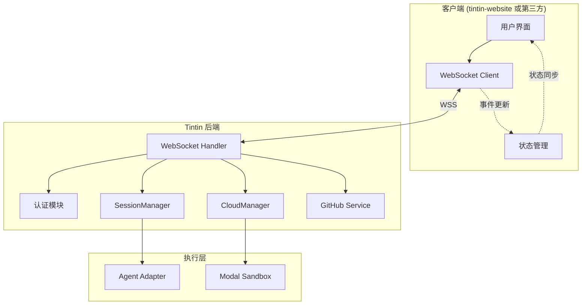
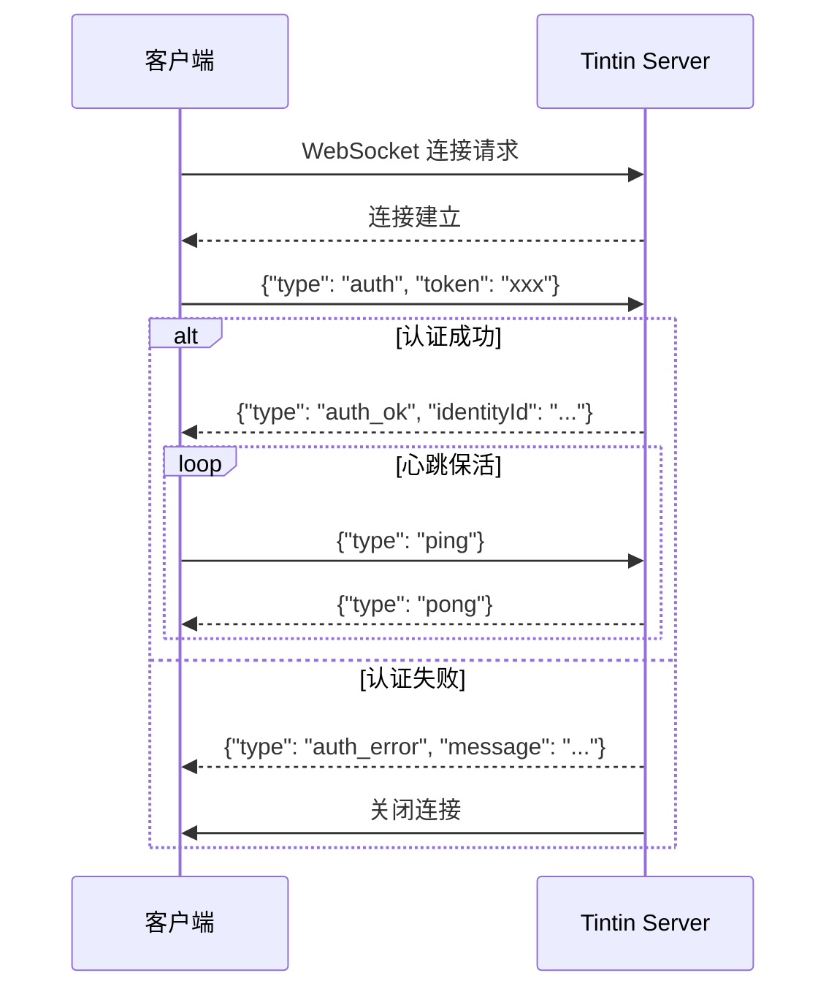
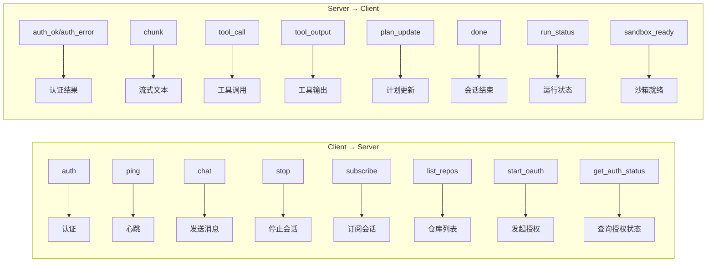
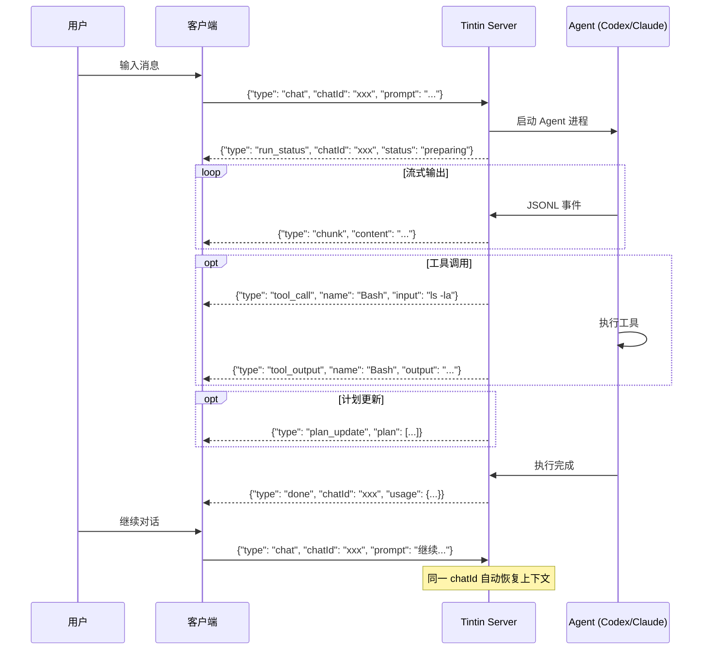
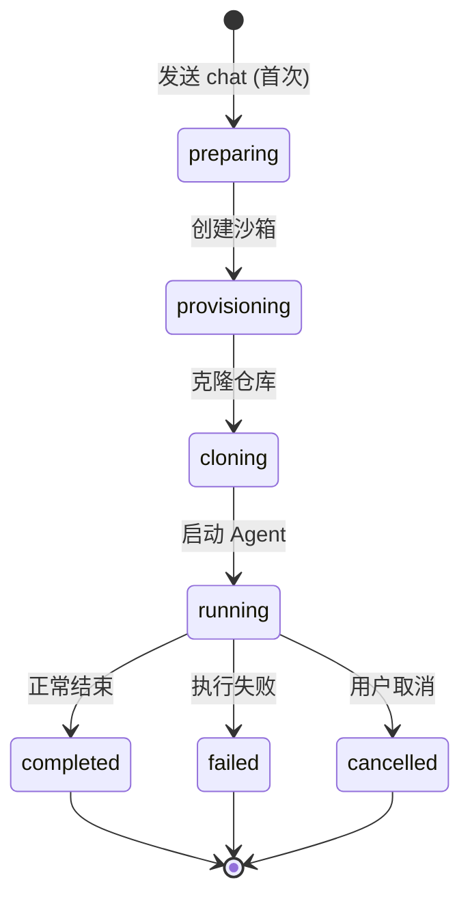
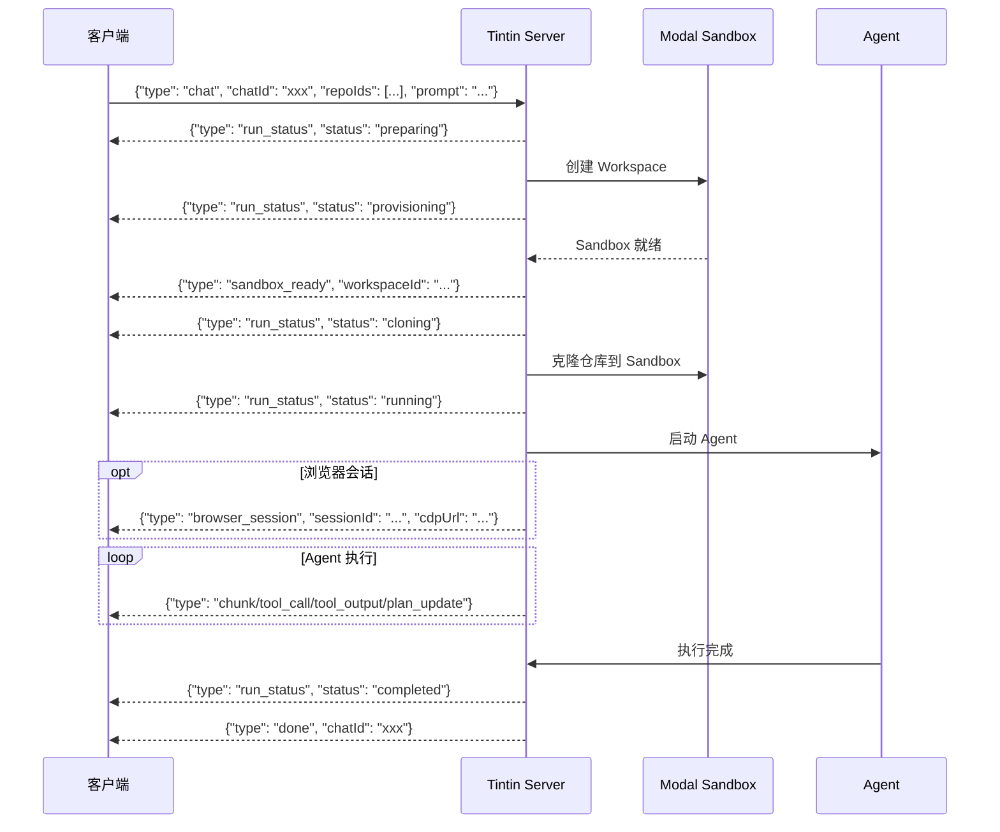
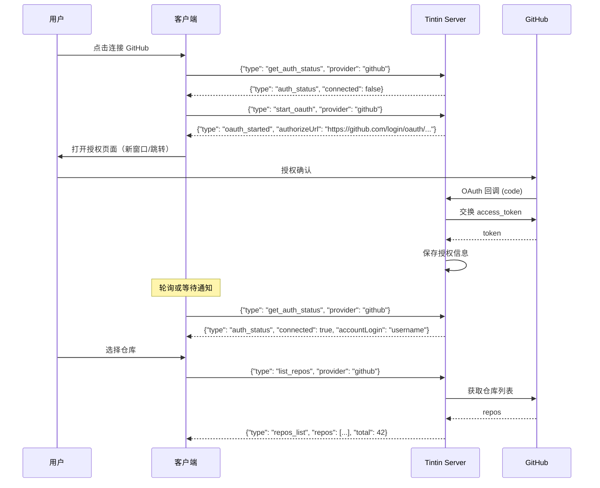
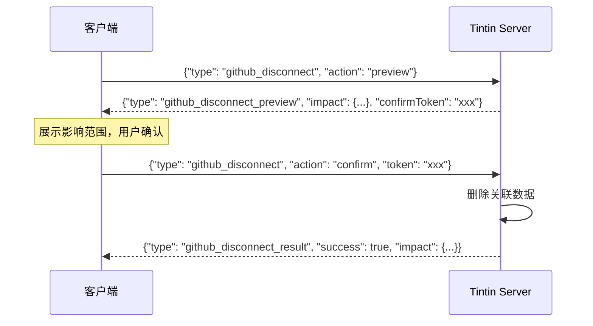
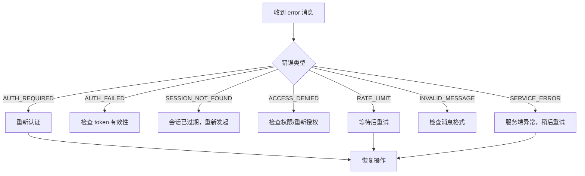
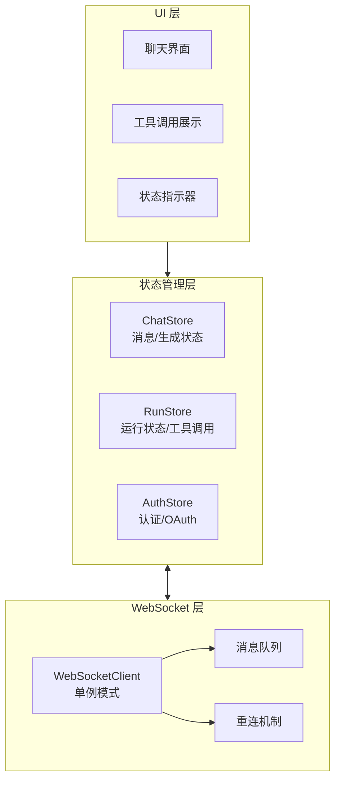

# Tintin WebSocket 集成指南

本文档为外部集成方提供 Tintin WebSocket API 的完整接入指南，包含架构说明、消息协议、业务流程和最佳实践。

## 目录

1. [概述](#1-概述)
2. [系统架构](#2-系统架构)
3. [快速开始](#3-快速开始)
4. [连接与认证](#4-连接与认证)
5. [消息协议参考](#5-消息协议参考)
6. [业务流程](#6-业务流程)
   - [6.1 Chat 会话](#61-chat-会话)
   - [6.2 Cloud Run 云执行](#62-cloud-run-云执行)
   - [6.3 GitHub OAuth](#63-github-oauth)
7. [错误处理](#7-错误处理)
8. [最佳实践](#8-最佳实践)
9. [附录：完整消息类型定义](#9-附录完整消息类型定义)

---

## 1. 概述

Tintin 是一个 Chat 驱动的编程 Agent 控制平台，支持通过 WebSocket 实时交互。客户端可以：

- 发送自然语言指令，由 Agent（Codex 或 Claude Code）执行
- 实时接收 Agent 的流式输出、工具调用和执行结果
- 在云沙箱中运行代码，获取预览链接和编辑器访问
- 通过 GitHub OAuth 授权访问私有仓库

### 适用场景

- 构建自定义的 AI 编程助手界面
- 集成 Tintin 到现有开发工具或 IDE
- 实现跨平台的编程任务自动化

---

## 2. 系统架构

### 整体架构图



### 核心组件说明

| 组件 | 职责 |
|------|------|
| **WebSocket Handler** | 连接管理、消息路由、认证校验 |
| **SessionManager** | 本地 Agent 会话生命周期管理 |
| **CloudManager** | 云沙箱创建、仓库克隆、执行编排 |
| **GitHub Service** | OAuth 授权、仓库列表、权限管理 |
| **Agent Adapter** | Codex/Claude Code CLI 进程管理 |
| **Modal Sandbox** | 隔离的云执行环境 |

---

## 3. 快速开始

### 最小示例（JavaScript）

```javascript
const ws = new WebSocket('wss://your-host/api/ws/chat');

// 连接成功后认证
ws.onopen = () => {
  ws.send(JSON.stringify({
    type: 'auth',
    token: 'your-auth-token'
  }));
};

// 处理消息
ws.onmessage = (event) => {
  const msg = JSON.parse(event.data);

  switch (msg.type) {
    case 'auth_ok':
      console.log('认证成功，identityId:', msg.identityId);
      // 发送第一条消息
      ws.send(JSON.stringify({
        type: 'chat',
        chatId: crypto.randomUUID(),
        prompt: '列出当前目录的文件'
      }));
      break;

    case 'chunk':
      process.stdout.write(msg.content);
      break;

    case 'tool_call':
      console.log(`\n[工具调用] ${msg.name}: ${msg.input}`);
      break;

    case 'tool_output':
      console.log(`[工具输出] ${msg.output}`);
      break;

    case 'done':
      console.log('\n执行完成');
      break;

    case 'error':
      console.error('错误:', msg.code, msg.message);
      break;
  }
};
```

---

## 4. 连接与认证

### 连接地址

```
生产环境: wss://{host}/api/ws/chat
开发环境: ws://127.0.0.1:9393/api/ws/chat
```

### 认证流程



### 认证参数

| 字段 | 类型 | 必填 | 说明 |
|------|------|------|------|
| `type` | string | 是 | 固定值 `"auth"` |
| `token` | string | 否 | 认证令牌（未提供则为匿名连接） |

### 心跳机制

- 客户端应每 **30 秒** 发送一次 `ping` 消息
- 服务端响应 `pong` 消息
- 超过 **60 秒** 无活动，服务端将主动断开连接

```javascript
// 心跳示例
setInterval(() => {
  if (ws.readyState === WebSocket.OPEN) {
    ws.send(JSON.stringify({ type: 'ping' }));
  }
}, 30000);
```

### 断线重连策略

推荐实现指数退避重连：

```javascript
class ReconnectingWebSocket {
  constructor(url) {
    this.url = url;
    this.reconnectDelay = 1000;  // 初始 1 秒
    this.maxDelay = 30000;       // 最大 30 秒
    this.messageQueue = [];      // 断线期间消息缓存
  }

  connect() {
    this.ws = new WebSocket(this.url);

    this.ws.onopen = () => {
      this.reconnectDelay = 1000;  // 重置延迟
      this.flushQueue();           // 发送缓存消息
    };

    this.ws.onclose = () => {
      setTimeout(() => this.connect(), this.reconnectDelay);
      this.reconnectDelay = Math.min(this.reconnectDelay * 2, this.maxDelay);
    };
  }

  send(message) {
    if (this.ws.readyState === WebSocket.OPEN) {
      this.ws.send(JSON.stringify(message));
    } else {
      this.messageQueue.push(message);  // 缓存消息
    }
  }

  flushQueue() {
    while (this.messageQueue.length > 0) {
      this.ws.send(JSON.stringify(this.messageQueue.shift()));
    }
  }
}
```

---

## 5. 消息协议参考

### 消息分类概览



### Client → Server 消息

| 类型 | 用途 | 关键字段 |
|------|------|----------|
| `auth` | 认证 | `token` |
| `ping` | 心跳 | - |
| `chat` | 发送消息 | `chatId`, `prompt`, `repoIds?`, `agent?` |
| `stop` | 停止会话 | `chatId` |
| `subscribe` | 订阅会话 | `chatId` |
| `list_runs` | 运行列表 | `limit?` |
| `list_repos` | 获取仓库 | `provider?`, `search?` |
| `start_oauth` | 发起 OAuth | `provider` |
| `get_auth_status` | 查询授权 | `provider` |
| `github_disconnect` | 断开 GitHub | `action`, `token?` |

### Server → Client 消息

| 类型 | 用途 | 关键字段 |
|------|------|----------|
| `auth_ok` | 认证成功 | `identityId` |
| `auth_error` | 认证失败 | `message` |
| `chunk` | 流式输出 | `chatId`, `content` |
| `tool_call` | 工具调用 | `chatId`, `name`, `input?` |
| `tool_output` | 工具结果 | `chatId`, `name`, `output` |
| `plan_update` | 计划更新 | `chatId`, `plan[]` |
| `done` | 会话结束 | `chatId`, `stopped?`, `usage?` |
| `run_status` | 云运行状态 | `chatId`, `status`, `message?` |
| `browser_session` | 浏览器会话 | `sessionId`, `cdpUrl`, `provider` |
| `sandbox_ready` | 沙箱就绪 | `workspaceId` |
| `error` | 错误 | `code`, `message` |

---

## 6. 业务流程

### 6.1 Chat 会话

#### 流程图



#### 发起会话

```javascript
// 首条消息
ws.send(JSON.stringify({
  type: 'chat',
  chatId: 'unique-chat-id',      // 客户端生成，UUID 推荐
  prompt: '创建一个 React 组件',
  repoIds: ['repo-id-1'],        // 可选，指定仓库
  agent: 'claude_code'           // 可选，codex 或 claude_code
}));

// 后续消息（同一 chatId）
ws.send(JSON.stringify({
  type: 'chat',
  chatId: 'unique-chat-id',      // 相同 chatId
  prompt: '添加单元测试'          // 自动继承上下文
}));
```

#### 接收流式输出

| 消息类型 | 处理方式 |
|----------|----------|
| `chunk` | 拼接文本内容，实时显示 |
| `tool_call` | 展示工具名称和输入参数 |
| `tool_output` | 与对应 `tool_call` 配对展示 |
| `plan_update` | 更新任务计划 UI |
| `done` | 标记会话结束，展示 token 统计 |

#### 停止会话

```javascript
ws.send(JSON.stringify({
  type: 'stop',
  chatId: 'unique-chat-id'
}));
// 将收到 done 消息，stopped: true
```

#### 订阅会话

用于跨设备同步或多窗口场景：

```javascript
ws.send(JSON.stringify({
  type: 'subscribe',
  chatId: 'existing-chat-id'
}));
// 之后会收到该会话的所有消息
```

---

### 6.2 Cloud Run 云执行

#### 生命周期状态图



#### 完整流程图



#### run_status 状态说明

| 状态 | 含义 | 客户端处理 |
|------|------|------------|
| `preparing` | 准备中 | 显示加载状态 |
| `provisioning` | 创建沙箱 | 显示「正在创建环境」 |
| `cloning` | 克隆仓库 | 显示「正在克隆代码」 |
| `running` | 执行中 | 显示 Agent 输出 |
| `completed` | 完成 | 显示成功状态 |
| `failed` | 失败 | 显示错误信息 |
| `cancelled` | 取消 | 显示已取消 |

#### browser_session 浏览器会话

当云沙箱中有浏览器可用时，服务器会发送此消息：

```typescript
interface BrowserSessionMessage {
  type: 'browser_session';
  sessionId: string;
  cdpUrl: string;          // Chrome DevTools Protocol URL
  liveViewUrl?: string;    // 实时预览 URL
  provider: 'hyperbrowser';
}
```

#### 从快照恢复

```javascript
ws.send(JSON.stringify({
  type: 'chat',
  chatId: 'new-chat-id',
  prompt: '继续上次的工作',
  restoreSnapshotId: 'snapshot-id'  // 从指定快照恢复
}));
```

---

### 6.3 GitHub OAuth

#### 授权流程图



#### 查询授权状态

```javascript
ws.send(JSON.stringify({
  type: 'get_auth_status',
  provider: 'github'  // 或 'gitlab'
}));

// 响应
{
  type: 'auth_status',
  provider: 'github',
  connected: true,
  accountLogin: 'octocat',
  installationId: '12345678'
}
```

#### 发起授权

```javascript
ws.send(JSON.stringify({
  type: 'start_oauth',
  provider: 'github'
}));

// 响应
{
  type: 'oauth_started',
  provider: 'github',
  authorizeUrl: 'https://github.com/login/oauth/authorize?...'
}

// 客户端打开授权页面
window.open(authorizeUrl, '_blank');
```

#### 获取仓库列表

```javascript
ws.send(JSON.stringify({
  type: 'list_repos',
  provider: 'github',
  search: 'react'  // 可选，模糊搜索
}));

// 响应
{
  type: 'repos_list',
  repos: [
    {
      id: 'repo-123',
      name: 'my-react-app',
      url: 'https://github.com/user/my-react-app',
      provider: 'github',
      defaultBranch: 'main'
    }
  ],
  total: 42
}
```

#### 断开连接流程图



```javascript
// 1. 预览影响
ws.send(JSON.stringify({
  type: 'github_disconnect',
  action: 'preview'
}));

// 响应
{
  type: 'github_disconnect_preview',
  impact: {
    repos: 5,
    runs: 12,
    sessions: 8,
    screenshots: 24,
    snapshots: 3
  },
  confirmToken: 'temp-token',
  expiresIn: 300000  // 5 分钟有效
}

// 2. 确认断开
ws.send(JSON.stringify({
  type: 'github_disconnect',
  action: 'confirm',
  token: 'temp-token'
}));
```

---

## 7. 错误处理

### 错误处理流程图



### 错误码定义

| 错误码 | 含义 | 处理建议 |
|--------|------|----------|
| `AUTH_REQUIRED` | 未认证或认证已过期 | 发送 `auth` 消息重新认证 |
| `AUTH_FAILED` | 认证失败 | 检查 token 是否有效 |
| `SESSION_NOT_FOUND` | 会话不存在 | 会话已结束或过期，需重新发起 |
| `ACCESS_DENIED` | 无权限访问 | 检查仓库授权状态 |
| `RATE_LIMIT` | 请求频率超限 | 使用指数退避重试 |
| `INVALID_MESSAGE` | 消息格式错误 | 检查消息结构和必填字段 |
| `SERVICE_ERROR` | 服务端内部错误 | 记录日志，稍后重试 |
| `RUN_NOT_RESUMABLE` | 运行无法恢复 | 需要重新发起运行 |

### 错误消息结构

```typescript
interface ErrorMessage {
  type: 'error';
  code?: string;       // 错误码
  message: string;     // 可读描述
  sessionId?: string;  // 关联的会话（如有）
}
```

### 错误处理示例

```javascript
ws.onmessage = (event) => {
  const msg = JSON.parse(event.data);

  if (msg.type === 'error') {
    switch (msg.code) {
      case 'AUTH_REQUIRED':
        // 重新认证
        ws.send(JSON.stringify({ type: 'auth', token: getNewToken() }));
        break;

      case 'RATE_LIMIT':
        // 指数退避重试
        setTimeout(() => retryLastMessage(), retryDelay);
        retryDelay = Math.min(retryDelay * 2, 30000);
        break;

      case 'SESSION_NOT_FOUND':
        // 清理本地状态，提示用户
        clearSessionState(msg.sessionId);
        showNotification('会话已过期，请重新开始');
        break;

      default:
        console.error('未知错误:', msg.code, msg.message);
    }
  }
};
```

### 连接级错误处理

| 场景 | 处理方式 |
|------|----------|
| 连接断开 | 自动重连 + 消息队列重发 |
| 认证超时（30s） | 服务端断开，客户端重连 |
| 心跳超时（60s） | 服务端断开，客户端重连 |

---

## 8. 最佳实践

### 客户端架构建议



### 连接管理

```javascript
// 推荐：单例模式
class WebSocketClient {
  static instance = null;

  static getInstance() {
    if (!WebSocketClient.instance) {
      WebSocketClient.instance = new WebSocketClient();
    }
    return WebSocketClient.instance;
  }
}
```

**要点：**
- 使用单例模式管理 WebSocket 连接
- 断线自动重连，指数退避避免服务端压力
- 维护消息队列，断线期间缓存发送请求（建议上限 100 条）

### 状态管理

**推荐按职责分离 Store：**

| Store | 职责 |
|-------|------|
| `ChatStore` | 消息列表、生成状态、错误信息 |
| `RunStore` | 运行状态、工具调用、计划步骤、访问链接 |
| `AuthStore` | 认证状态、OAuth 连接、用户信息 |

**工具调用配对：**

```javascript
class ToolCallManager {
  constructor() {
    this.pendingCalls = [];  // FIFO 队列
  }

  pushCall(toolCall) {
    this.pendingCalls.push(toolCall);
  }

  matchOutput(toolOutput) {
    // 按顺序配对
    return this.pendingCalls.shift();
  }
}
```

### 性能优化

| 场景 | 优化方式 |
|------|----------|
| `chunk` 高频更新 | 使用节流（throttle）或批量更新，减少渲染次数 |
| 大量工具输出 | 虚拟滚动（virtual scroll） |
| 长时间会话 | 定期清理历史消息，保留最近 N 条 |

```javascript
// chunk 消息节流示例
let chunkBuffer = '';
let flushTimer = null;

function handleChunk(content) {
  chunkBuffer += content;

  if (!flushTimer) {
    flushTimer = setTimeout(() => {
      updateUI(chunkBuffer);
      chunkBuffer = '';
      flushTimer = null;
    }, 50);  // 50ms 批量更新
  }
}
```

### 安全考虑

- **Token 安全**：不要硬编码，从安全存储获取
- **传输加密**：生产环境必须使用 `wss://`
- **日志脱敏**：敏感信息（OAuth token 等）不在前端日志输出
- **消息校验**：校验服务端消息格式，防止注入

### 调试技巧

```javascript
// 开发环境记录所有消息
if (process.env.NODE_ENV === 'development') {
  ws.onmessage = (event) => {
    console.log('← 收到:', JSON.parse(event.data));
    handleMessage(event);
  };

  const originalSend = ws.send.bind(ws);
  ws.send = (data) => {
    console.log('→ 发送:', JSON.parse(data));
    originalSend(data);
  };
}
```

- 使用浏览器 DevTools → Network → WS 面板查看 WebSocket 帧
- 服务端日志配合 `sessionId` / `chatId` 追踪问题

---

## 9. 附录：完整消息类型定义

### A. Client → Server 消息

```typescript
// 认证
interface AuthMessage {
  type: 'auth';
  token?: string;
}

// 心跳
interface PingMessage {
  type: 'ping';
}

// 发送聊天消息
interface ChatMessage {
  type: 'chat';
  chatId: string;                    // 客户端生成的会话 ID（UUID）
  prompt: string;                    // 用户输入
  repoIds?: string[];                // 可选，首条消息指定仓库
  agent?: 'codex' | 'claude_code';   // 可选，指定 Agent
  restoreSnapshotId?: string;        // 可选，从快照恢复
}

// 停止会话
interface StopMessage {
  type: 'stop';
  chatId: string;
}

// 订阅会话
interface SubscribeMessage {
  type: 'subscribe';
  chatId: string;
}

// 获取运行列表
interface ListRunsMessage {
  type: 'list_runs';
  limit?: number;  // 默认 5
}

// 获取仓库列表
interface ListReposMessage {
  type: 'list_repos';
  provider?: 'github' | 'gitlab';
  search?: string;
}

// 查询授权状态
interface GetAuthStatusMessage {
  type: 'get_auth_status';
  provider: 'github' | 'gitlab';
}

// 发起 OAuth
interface StartOAuthMessage {
  type: 'start_oauth';
  provider: 'github' | 'gitlab';
}

// 断开 GitHub
interface GitHubDisconnectMessage {
  type: 'github_disconnect';
  action: 'preview' | 'confirm';
  token?: string;  // action 为 confirm 时必填
}
```

### B. Server → Client 消息

```typescript
// 认证成功
interface AuthOkMessage {
  type: 'auth_ok';
  identityId?: string;
}

// 认证失败
interface AuthErrorMessage {
  type: 'auth_error';
  message: string;
}

// 心跳响应
interface PongMessage {
  type: 'pong';
}

// 流式文本输出
interface ChunkMessage {
  type: 'chunk';
  chatId: string;
  content: string;
}

// 工具调用
interface ToolCallMessage {
  type: 'tool_call';
  chatId: string;
  name: string;     // Bash, Read, Write, Edit, Glob, Grep...
  input?: string;
}

// 工具输出
interface ToolOutputMessage {
  type: 'tool_output';
  chatId: string;
  name: string;
  output: string;
}

// Agent 事件（高级）
interface AgentEventMessage {
  type: 'agent_event';
  chatId: string;
  command: string;
  subcommand: string;
  request: {
    method: string;
    path: string;
    query?: Record<string, string>;
    body?: unknown;
  };
  response: {
    status: number;
    body?: unknown;
    error?: string;
  };
}

// 计划更新
interface PlanUpdateMessage {
  type: 'plan_update';
  chatId: string;
  plan: Array<{
    step: string;
    status: 'pending' | 'in_progress' | 'done' | 'failed';
  }>;
  explanation?: string;
}

// 会话结束
interface DoneMessage {
  type: 'done';
  chatId: string;
  stopped?: boolean;  // true 表示用户主动停止
  usage?: {
    promptTokens: number;
    completionTokens: number;
    totalTokens: number;
  };
}

// 错误
interface ErrorMessage {
  type: 'error';
  code?: string;
  message: string;
  sessionId?: string;
}

// 云运行状态
interface RunStatusMessage {
  type: 'run_status';
  chatId: string;
  status: 'preparing' | 'provisioning' | 'cloning' | 'running'
        | 'completed' | 'failed' | 'cancelled';
  message?: string;
}

// 浏览器会话
interface BrowserSessionMessage {
  type: 'browser_session';
  sessionId: string;
  cdpUrl: string;
  liveViewUrl?: string;
  provider: 'hyperbrowser';
}

// 沙箱状态
interface SandboxStatusMessage {
  type: 'sandbox_status';
  status: 'provisioning' | 'ready' | 'in_use' | 'terminating' | 'error';
  workspaceId?: string;
  message?: string;
}

// 沙箱就绪
interface SandboxReadyMessage {
  type: 'sandbox_ready';
  workspaceId: string;
}

// 沙箱错误
interface SandboxErrorMessage {
  type: 'sandbox_error';
  message: string;
  recoverable: boolean;
}

// 仓库列表
interface ReposListMessage {
  type: 'repos_list';
  repos: Array<{
    id: string;
    name: string;
    url: string;
    provider: string;
    defaultBranch: string | null;
  }>;
  total: number;
}

// 授权状态
interface AuthStatusMessage {
  type: 'auth_status';
  provider: string;
  connected: boolean;
  accountLogin?: string;
  installationId?: string;
}

// OAuth 已发起
interface OAuthStartedMessage {
  type: 'oauth_started';
  provider: string;
  authorizeUrl: string;
}

// GitHub 断开预览
interface GitHubDisconnectPreviewMessage {
  type: 'github_disconnect_preview';
  impact: {
    repos: number;
    runs: number;
    sessions: number;
    screenshots: number;
    snapshots: number;
  };
  confirmToken: string;
  expiresIn: number;  // 毫秒
}

// GitHub 断开结果
interface GitHubDisconnectResultMessage {
  type: 'github_disconnect_result';
  success: true;
  impact: { /* 同上 */ };
}

// 运行列表
interface RunsListMessage {
  type: 'runs_list';
  runs: Array<{
    id: string;
    status: string;
    prompt: string;
    platform: string;
    diffSummary: string | null;
    createdAt: number;
  }>;
}

// 运行完成通知
interface RunCompletedNotificationMessage {
  type: 'run_completed_notification';
  runId: string;
  status: 'completed' | 'error';
  title: string;
  diffStats: {
    filesChanged: number;
    additions: number;
    deletions: number;
  } | null;
  screenshotUrl: string | null;
  viewUrl: string;
  vscodeUrl: string | null;
  initiatorPlatform: string;
  finishedAt: number;
}
```

### C. 错误码常量

```typescript
const ErrorCodes = {
  AUTH_REQUIRED: 'AUTH_REQUIRED',
  AUTH_FAILED: 'AUTH_FAILED',
  SESSION_NOT_FOUND: 'SESSION_NOT_FOUND',
  ACCESS_DENIED: 'ACCESS_DENIED',
  RATE_LIMIT: 'RATE_LIMIT',
  INVALID_MESSAGE: 'INVALID_MESSAGE',
  SERVICE_ERROR: 'SERVICE_ERROR',
  RUN_NOT_RESUMABLE: 'RUN_NOT_RESUMABLE',
} as const;
```

### D. 状态枚举

```typescript
// 云运行状态
type CloudRunStatus =
  | 'preparing'
  | 'provisioning'
  | 'cloning'
  | 'running'
  | 'completed'
  | 'failed'
  | 'cancelled';

// 沙箱状态
type SandboxStatus =
  | 'provisioning'
  | 'ready'
  | 'in_use'
  | 'terminating'
  | 'error';

// 计划步骤状态
type PlanStepStatus =
  | 'pending'
  | 'in_progress'
  | 'done'
  | 'failed';
```

---

## 参考资源

- **tintin-website 参考实现**：完整的 Next.js 前端实现
- **WebSocket 类型定义**：`src/runtime/websocket/types.ts`
- **WebSocket 处理器**：`src/runtime/websocket/handler.ts`

---

*文档版本: 1.0*
*最后更新: 2026-02-06*
